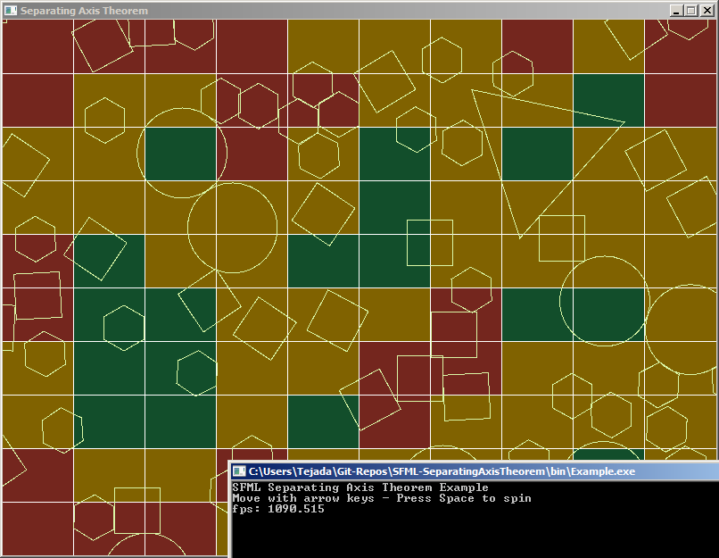

# SFML-SeparatingAxisTheorem
Demonstration of SAXT using SFML shapes

## Inctroduction
I wrote this code because I wanted to push my own understanding about collision detection and push my math skills. In this project you will find a pretty decent implementation of the separating axis theorem for convex polygonal collision detection. Collision detection between SFML's base shape types like sf::RectangleShape, sf::CircleShape and sf::ConvexShape are all supported. Calculations are kept low by using a grid partitioning system. In the future I'd like to implement a quad-tree and maybe concave collision resolution.

## How to build
This project only depends on SFML so if it is installed you should be all set.

I provided an Example.cpp that serves to demonstrate the collision detection in action. To build the example program on Windows with Visual Studio open a `Developer Command Prompt` and enter this:

Change your directory to the source directory
>cd C:/path/to/source

Compile and link the source code
>cl /I C:/path/to/SFML/include C:/path/to/SFML/lib/sfml-system.lib C:/path/to/SFML/lib/sfml-window.lib C:/path/to/SFML/lib/sfml-graphics.lib Example.cpp

The code should compile and produce Example.exe.

If you are using MinGW open a `Command Prompt` and enter this:

Setup your path variable
>path=C:/path/to/MinGW/bin

Change your directory to the source directory
>cd C:/path/to/source

Compile and link the source code
>mingw32-make

Note! Don't forget to edit the Makefile to make the directories point to where you installed SFML

## How to use
You control a giant triangle with the arrow keys and you can spin it by pressing the space button.